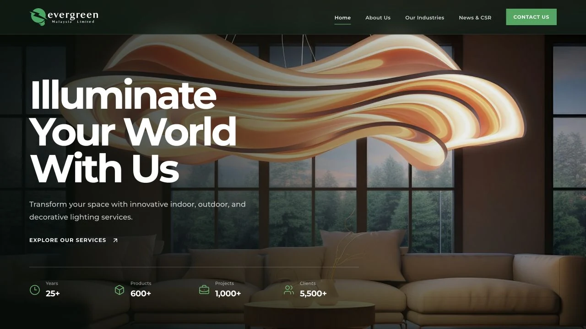
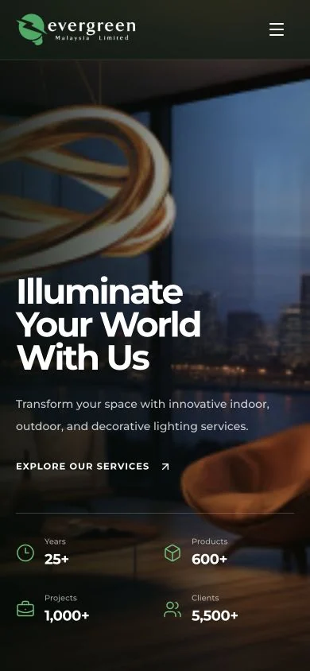

<p align="center">
  
</p>

<h1 align="center">Evergreen Lighting Malaysia</h1>

<p align="center">
  A fast, elegant, and accessible lighting website built for Malaysian homes,
  businesses, designers, and landmark spaces.
</p>

<p align="center">
  
  
  
  
</p>

---

## ✨ Preview



<p align="center">
  
</p>

## 🌿 What this website delivers

- Responsive, mobile-first layouts with a restrained Evergreen visual system
- Local, optimized imagery and self-hosted Montserrat typography
- Smooth reveal and carousel motion with reduced-motion support
- Server Components by default and narrowly scoped client-side interactivity
- Complete company, industry, news, contact, legal, and accessibility content
- Privacy-aware live Google Maps that load only after a visitor chooses to
  connect
- Static generation for fast delivery and predictable hosting costs
- Canonical metadata, Open Graph cards, structured data, sitemap, and robots
- Keyboard-friendly navigation, visible focus states, semantic landmarks, and
  accessible form labels
- No analytics, advertising trackers, marketing cookies, or unnecessary consent
  banner in the current build

## 🖼️ Screens

| Area | Route | Purpose |
| --- | --- | --- |
| Home | `/` | Brand story, certifications, experience, industries, news, and CTA |
| About | `/about-us` | Vision, mission, milestones, team, and distribution |
| Industries | `/our-industries` | Residential, industrial, commercial, and design collaboration |
| News & CSR | `/news-csr` | Insight and community article index |
| Article | `/news-csr/[slug]` | Statically generated editorial detail pages |
| Contact | `/contact-us` | Locations and privacy-aware email enquiry flow |
| Privacy | `/privacy-policy` | Personal-data handling notice |
| Terms | `/terms-of-use` | Website usage conditions |
| Cookies | `/cookie-policy` | Current cookie and browser-storage position |
| Accessibility | `/accessibility` | Inclusive-design commitment and feedback |

A custom no-index 404 page handles unknown routes. The site also publishes
`/sitemap.xml`, `/robots.txt`, `/manifest.webmanifest`, and
`/.well-known/security.txt`.

## 🧰 Technology

- **Framework:** Next.js 16 App Router
- **UI:** React 19 and Tailwind CSS 4
- **Language:** TypeScript 6 in strict mode
- **Motion:** Motion for React
- **Carousel:** Embla Carousel
- **Icons:** Lucide React
- **Images:** `next/image` with AVIF/WebP negotiation and long-lived caching
- **Font:** Self-hosted Montserrat through `next/font`

## 🚀 Local development

Requirements:

- Node.js 20.9 or newer
- npm 10 or newer

```bash
npm install
npm run dev
```

Open [http://localhost:3000](http://localhost:3000).

For a production-mode local run:

```bash
npm run build
npm start
```

## ✅ Quality gate

Run the complete repository gate before every handoff:

```bash
npm run check
npm audit --omit=dev
```

`npm run check` runs ESLint, strict TypeScript validation, and the optimized
Next.js production build.

Rendered changes should additionally be checked in a real browser at desktop
and mobile widths, including navigation, interactive controls, lazy-loaded
images, horizontal overflow, console output, and reduced-motion behavior.

## 🗂️ Project map

```text
app/
├── (route folders)          Pages, metadata, legal routes, and articles
├── fonts/                   Self-hosted Montserrat
├── layout.tsx               Global metadata and document shell
├── manifest.ts              Web app manifest
├── robots.ts                Search crawler policy
└── sitemap.ts               Canonical route discovery
components/
├── home/                    Homepage sections and carousel
├── layout/                  Shared header and footer
├── pages/                   Inner-page, map, form, and legal-page components
├── seo/                     Safe JSON-LD rendering
└── ui/                      Shared links and motion primitives
lib/
├── metadata.ts              Shared canonical and social metadata builder
└── news.ts                  Typed editorial content source
public/images/
├── home/                    Optimized homepage assets
└── pages/                   Optimized inner-page assets
```

The root [`AGENTS.md`](./AGENTS.md) is the maintenance contract for coding
agents and contributors. This README is the durable product and operations
reference.

## 🔐 Privacy and content model

The website has no database, authentication system, payment flow, analytics
SDK, or advertising integration. The enquiry form prepares a message in the
visitor's email application and does not submit personal data to a website API.
Contact-page maps are click-to-load: no Google Maps request is made until the
visitor explicitly loads a map or follows the external map link.

Business details and approved copy must be treated as product data: confirm
them with Evergreen before changing addresses, contact details, legal identity,
certifications, statistics, or published articles.

## 📦 Deployment

The application is suitable for any current Next.js-compatible Node hosting
platform. Configure the canonical production domain as
`https://evergreenmalaysia.com`, run the quality gate, deploy the generated
production build, and verify the public routes, metadata, security headers,
images, and email click path at the live boundary.

No environment variables are currently required. If a future integration adds
secrets or visitor-data processing, document its environment contract, update
the legal notices, and add an appropriate provider-boundary test before release.

## 📄 License

Private proprietary website for Evergreen Lighting Malaysia. All rights
reserved.
